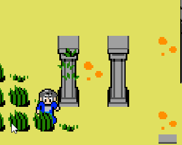
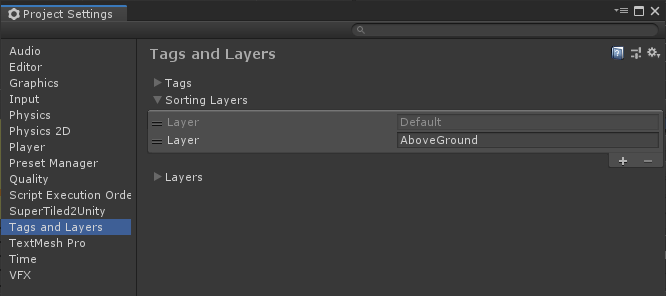
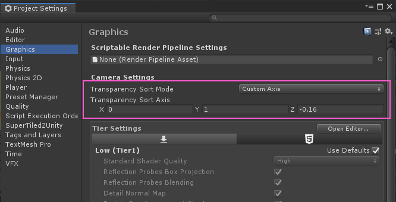
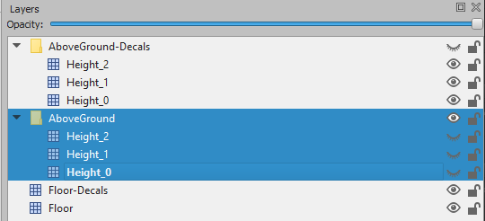
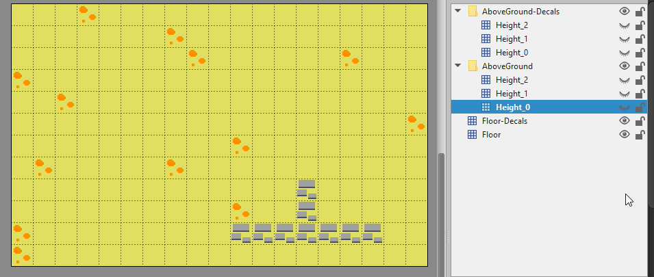
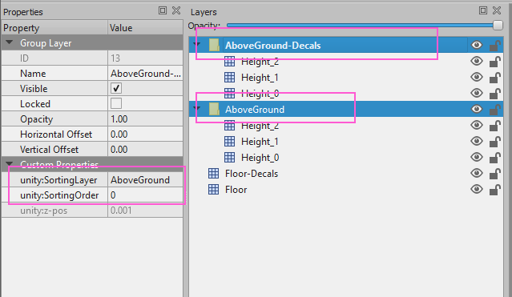
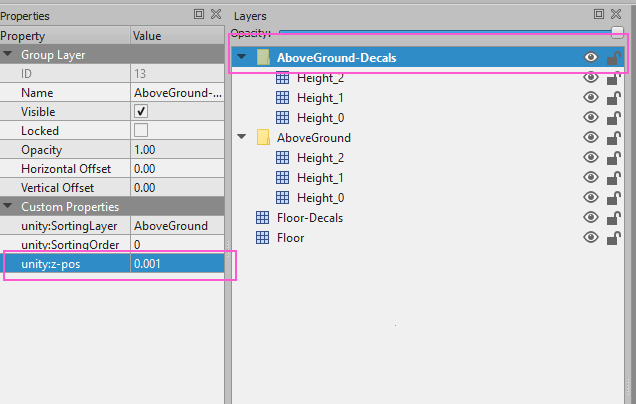
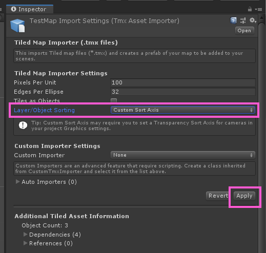

# "Ground Up Sort" SuperTiled2Unity Example

Demonstration of advanced sorting for overhead maps using Tiled, Unity, and SuperTiled2Unity. Sprites can sort automatically against tiles on different "height planes" and these tiles can themselves have other layers of decals on them (the vines on the column in the gif below).

The steps used to accomplish this dynamic sorting are:

1. Create a `Sort Layer` for your "grounded" layers in the Tags and Layers Project Settings in Unity. In this example we use a sort layer named `AboveGround`.

1. Use the `Custom Axis` Transparency SortMode in your Graphics Project Settings in Unity. Set the `Transparency Sort Axis` values correctly (z value will depend on your project).

1. Build your Tiled map "from the ground up" with different "height" layers grouped together.

1. In Tiled, use the `unity:z-pos` custom property (new with SuperTiled2Unity 1.8.1) to apply a small z-bias for grouped layers that stack on top of other layers. In this example, this is the vines on top of columns at a given height. Another example could be a picture or drape that hangs on a wall at a given height.

1. Use `Custom Sort Axis` sorting in the `TMX Asset Importer` inspector in Unity to import the map.

Creating a Sort Layer
---------------------

The sort layer comes after `Default` so that the tiles that lie "beneath" our player and "height" tiles are always rendered underneath.

> **Important**: In order for tiles and objects to sort properly they must, at a minimum, be using the same `Sort Layer` and `Sort Order`. This is easy to miss if you're not looking out for it. In Tiled you can force your tile layers to be on a particular layer and order by using the `unity:SortingLayer` and `unity:SortingOrder` custom properties.

Using a Custom Sort Axis
------------------------

We must override the camera in our project settings to use a custom axis for sorting. We want our tiles to sort depending on their y and z values.

For this project, we use a custom sort axis of `(0, 1, -0.16)`

This is how we calcuate our sort axis values:
* **X**: We don't value by x-values so leave it as zero.
* **Y**: This is always `1` as it is tied to the grid cell y-value (in Unity). Tiles based on higher y-value cells will be drawn first (and therefore appear to be under lower tiles that are drawn later).
* **Z**: We want tiles that stack on top of the ground to be sorted too. This value seems weird so here's the formula: `-1 * CellHeightInPixels / PixelsPerUnit`

Our example uses a grid that with 16x16 pixel cells and a `Pixels Per Unit` value of `100` (the default in Unity).

> `-1 * 16 / 100 = -0.16`

**Why is this value negative?** Because Unity uses a `left-handed coordinate system` with negative z sticking outwards towards the viewer. We want tiles "closer to our eyeballs" to sort along a negative axis.

Building a Map From the Ground Up
---------------------------------

We will need to author our map with tiles being on assigned to separate "height layers" that are grouped together. The grouping is important as tiles inside a group are applied to the Unity `Tilemap` at increasing z-values (i.e. at increasing heights).

This approach to map-building may seem a bit strange at first but in order for tiles to sort properly we must take their "height" into account.

Here's an animation showing how our example map is broken down into different "height layers".

> **Tip**: Take care when editing your map that you places tiles on the right layer. Getting in the habit of locking and unlocking your layers in Tiled will help.

Our `Group Layers` use the sorting layer we made earlier. Note that we also force these group layers to use the same sorting order.

Using the `z-pos` Custom Property
-------------------------------

This example is has the extra complication of having to sort decals that share the same y-position, height index, sorting order, and sorting layer as the tiles that are stacked on top of. We force these tiles to be drawn on top by giving the `Group Layer` a very small push in z-value towards the viewer. We do this by using a custom property named `unity:z-pos` that is used by the SuperTiled2Unity importer to assign a z-position.

> **Note:** The `unity:z-pos` custom property is new with version `1.8.1` of SuperTiled2Unity.

Import with Custom Sort Axis Option
-----------------------------------

Our map is now ready to be imported by SuperTiled2Unity. Our final step is to use the `Custom Sort Axis` option for sorting in the Unity inspector for our map.

**That should do it!** Thanks a good luck with your game.

-Sean Barton